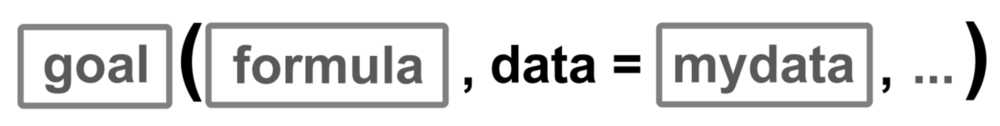
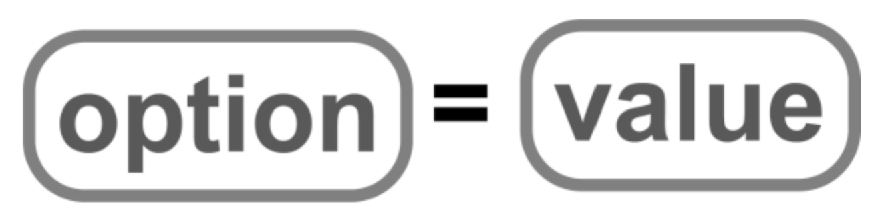
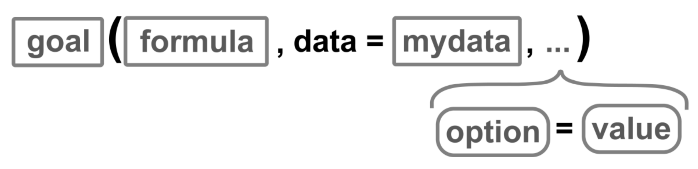
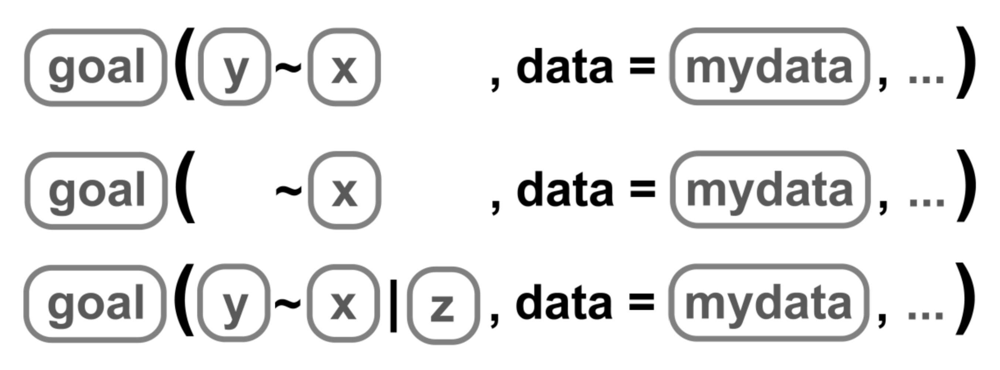
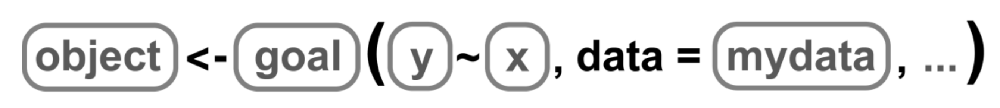
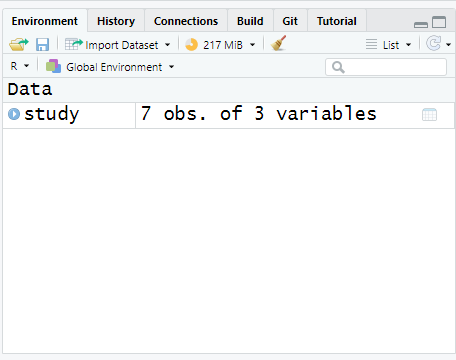
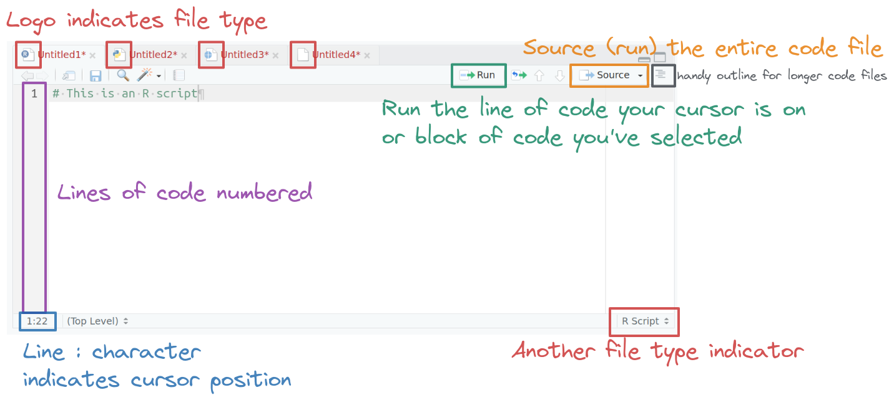
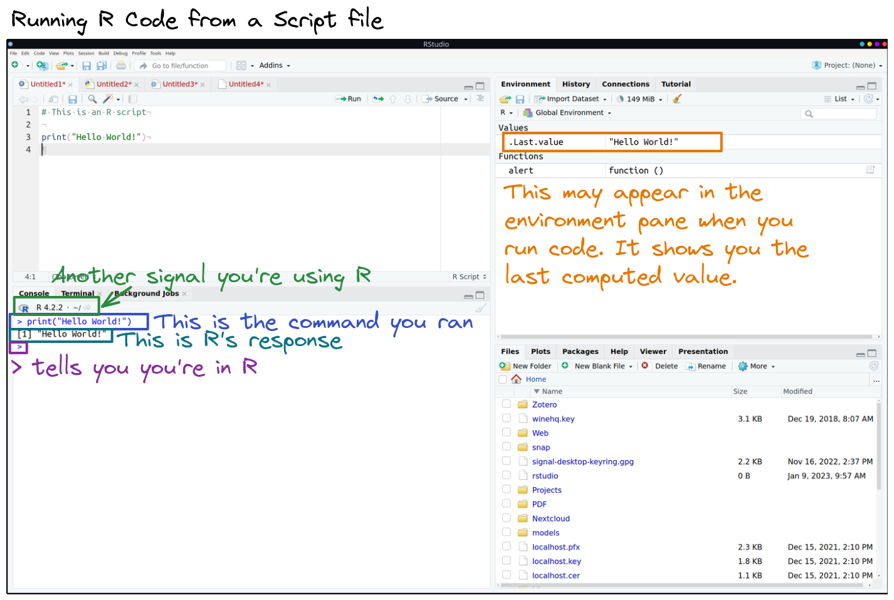
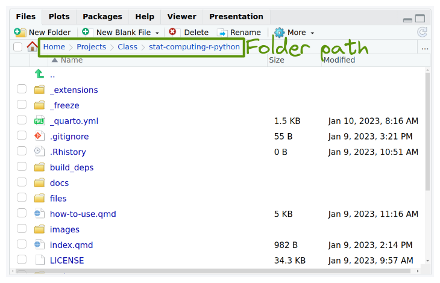
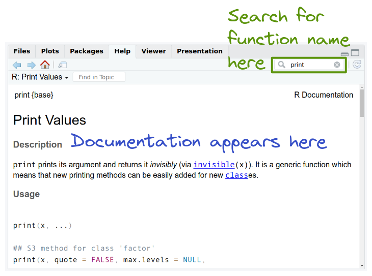



```{webr}
#| label: theme
#| include: false
#| edit: false
library(ggplot2)
theme_set(theme_light())
options(ggplot2.continuous.color = scale_color_viridis_c, 
        ggplot2.continuous.fill = scale_fill_viridis_c,
        ggplot2.discrete.color = scale_color_viridis_d,
        ggplot2.discrete.fill = scale_fill_viridis_d)
```

::: {.callout-note collapse="true" aria-label="Digital accessibility note"}
## Digital Accessibility
Please note that all images were created with modifications to the defaults to make them digitally accessible. If you recreate this code in another environment, your plots have different colors and backgrounds.
:::

# Introduction to R

*Did it increase? Did it decrease? Is it different? Was it successful? Did it achieve the goal? Are these things related? What might we expect?*

These are common questions for which you could imagine wanting an answer. The 'it' might change, depending on any particular job, but the ultimate questions remain the same, and they all are answered with statistics. While statistics used to be done by hand using long and sometimes complicated formulas, statistics are largely (and thankfully!) calculated by computers now and, more and more often, in fields in research, non-profits, government and industry, they are calculated using the program R.

Recall your earlier reading "Why R?" to remember all the reasons we will be learning R in this course. You might feel intimidated at first using a program that takes code, rather than a series of drop-down menus, but we'll walk through learning the basics of R so that when you leave the class you have a good grasp of R on which to continue building.

------------------------------------------------------------------------

## R Orientation

You have gotten a quick orientation to R in class. If you need a refresher, read, watch and follow along with [Chapter 3.4: RStudio Layout (12 min)](https://ismayc.github.io/rbasics-book/3-rstudiobasics.html#rstudio-layout){target="_blank"} in your own RStudio window to understand the use of different panes. You only need to read the entirety (including subsections) of Chapter 3.4, not the entire chapter 3. Don't feel like you need to understand all of the coding at this point, just get a sense of what each pane does.

Now that we have an overview of R, lets get started using R! Don't forget to start by first opening the lab project!

------------------------------------------------------------------------

## Data Organization

One of the key parts of statistical analyses is good organization of your data itself and your files.

You should always work in a project in R to help organize all the files associated with that particular project.

R expects data to be organized in a particular way to calculate and manipulate your raw data into statistics. Read [Data and Presentations (5 min)](https://dtkaplan.github.io/statPREP/Notes/Data_and_presentations.html){target="_blank"} regarding how data tables need to be arranged for statistical analyses (Tabular and Tidy). 


------------------------------------------------------------------------

## R Coding

R, at its most basic, can be thought of as the most powerful calculator you've ever had. R isn't powerful just from its calculation ability, but its ability to utilize ***functions*** to apply complex mathematical operations to whole sets of data, which is what we're going to learn.

Let's take a closer look at R commands. Complete the following primer: [RStudio Primer: Programming Basics (25 min)](https://r-primers.andrewheiss.com/basics/02-programming-basics/){target="_blank"}. (One additional note: the chapter gives some indication of the rules around object names, but doesn't include one last rule: object names can't have spaces!


### Loading Packages {#sec-loading-packages}

R comes with what is called a "Base" **package**, which contains numerous functions. There are tens of thousands of additional packages that contain even more packages for everything from 3-D visualizations to machine learning algorithms.  To use functions from other packages you must first install the package

```{r}
#| label: packages-install
#| eval: false
install.packages(c("ggformula", "mosaic", "tidyverse"))
```

**Installation only needs to happen once**.  If you are using the [CSUMB Cal ICOR Server](https://csumb.jupyter.cal-icor.org){target="_blank"} then the above packages are already installed and do not need to be installed again.

**Loading packages must happen each session**. We should always load our packages first thing. Go ahead and run the following code to load our needed packages.

```{r}
#| label: setup-r
#| include: false
library(ggformula)  #graphics
library(mosaic)   #summary statistics
library(tidyverse) #data management
```

```{webr}
#| label: setup-webr
library(ggformula)  #graphics
library(mosaic)   #summary statistics
library(tidyverse) #data management
```


### R Syntax

As you covered in class, the R language has its own set of grammatical rules. The good news is that once you've learned the basic R structure, it is easy to apply to new commands.

To get R (or any software) to do anything, there are two important questions you must be able to answer: 1) What do you want R to do, and 2) What must R know to do that?

The answers to those questions can help us fill in the boxes of our generic formula template:

{fig-align="center" fig-alt="Text that provides the template needed to run the functions used in the mosiac and ggformula packages in R. It states goal(formula, data = mydata, ...)" height=100}


**Q. What do you want R to do?**

**A. goal**

-   This determines the ***function*** to use.
-   Functions carry out commands from their inputs and create an output; in other words, we *apply* a function to its inputs to create the output.
-   For a plot, the function will describe what sorts of marks to draw (points, in our example). A function could also describe the type of calculation or descriptive statistic.

**Q. What must R know to do that?**

**A. arguments**

-   The inputs in R are called ***arguments***.
-   For a plot or statistic calculation, we must identify the variables and the data frame that contains them.

The application of a function to arguments follows a simple structure: the name of a function is followed by a pair of parentheses. Values for the arguments are specified *inside* the parentheses. If there is more than one argument, the arguments are always separated by a comma.

In the generic function above, `goal` is the name of any function. The arguments (`formula` & `mydata`) identify the variables and dataframe that contains them. The `...` indicates any additional arguments we many want to include.

Generally, functions are written as the name of the function followed by parentheses, e.g. `log()`. The empty parentheses are merely a reminder that the name refers to a function.

Sometimes, functions need more than one argument. R functions require the first argument supplied to them to be something specific, but then arguments can be added as needed -- those additional arguments need to be *named* so that R knows exactly what you are trying to specify. Named arguments always have the form:

{fig-align="center" fig-alt="Text that provides the template needed to add arguments to the functions used in the mosiac and ggformula packages in R. It states option = value" height=100}

Those arguments are added as needed in place of the `...` in our template (Fig 3). We can include as many arguments as needed as long as we separate each one with a comma.

{fig-align="center" fig-alt="Text that provides the template needed to run the functions used in the mosiac and ggformula packages in R with additional arguments. It states goal(formula, data = mydata, options = value, ...)" height=200}

#### Formula Template

The `formula` argument in our template is where we define the variable of data to which we want to apply our goal. There are actually a few options for what that variable can look like, depending on the variables we wish to use. We use `y` to designate our y-axis variable, `x` to designate our x-axis variable (or in the second case, one single variable), and `z` to designate a conditioning variable that lets us create separate panels when we group data. The `|z` can also be applied to the single variable `~x`.

{fig-align="center" fig-alt="Text that provides the template needed to run the functions used in the mosiac and ggformula packages in R. It states goal(formula, data = mydata, ...)" height=100}

#### Assembling the pieces

Now we need to put together the pieces we've learned with our actual scenario. For example, we might keep a record of the number of hours spent studying on each day of the week during week 1 and during week 2 of the semester. We want to make a graphic of the hours spent studying on each day of the week. In this case, we have two variables: `hours` and `day`, so we'll use the template:

{fig-align="center" fig-alt="Text that provides the template needed to run the functions used in the mosiac and ggformula packages in R. It states goal(y ~ x, data = mydata, ...), then goal( ~ x, data = mydata, ...), goal(y ~ x | z, data = mydata, ...)" height=300}

So let's identify the pieces.

| box      | fill in with | purpose             |
|----------|--------------|---------------------|
| `goal`   | `gf_col  `   | plot bars of values |
| `y`      | `hours`      | y-axis variable     |
| `x`      | `day`        | x-axis variable     |
| `mydata` | `study2`     | name of the dataset |


We need to fill in each piece into our template. So our code `goal (y ~ x , data = mydata)` becomes `gf_col(hours ~ day, data = study2)` and creates the following plot:

```{r}
#| label: read-study2
#| include: false
study2 <- read_csv("study2.csv", show_col_types = FALSE)
```

```{r}
#| label: factors-study2
#| include: false

study2 <- mutate(study2, day = factor(day, levels = c("M", "T", "W", "R", "F", "Sa", "Su")))
```

```{r}
#| label: barplot
#| fig-alt: "Bar plot of hours spend studying across each day of the week. Monday was 3 hours, Tuesday 5 hours, Wednesday 7 hours, Thursday 6 hours, Friday 0 hours, Saturday and Sunday 4 hours each."
gf_col(hours ~ day, data = study2, 
       ylab = "Hours spent studying in week 1 and week 2", 
       xlab = "Day of the week")
```

Learning any new software can feel daunting, but referring back to this template and asking yourself the two questions -- what do I want R to do? what must R know to do that? -- will help you throughout your time working with R.


### Vectors, Objects, & Dataframes

The real power of R comes not from calculating values like a calculator, but in manipulating sets of data. ***Vectors*** are sets of data that are organized together. Groups of vectors that are associated are ***dataframes***.

For example, we could load version of our data on hours spent studying in week 1 and week 2 that has three columns, one for day and one for each week. 

```{r}
#| label: read-study
#| echo: false
study <- read_csv("study.csv", show_col_types = FALSE)
study
```

To be able to work with the dataframe in R, we need to read the csv file into R, using `read_csv()` which comes from the `tidyverse` package. We apply that function to the name of the csv file we wish to load, inside quotation marks. Go ahead and run the following code.

```{webr}
#| label: read_csv-only
read_csv("study.csv")
```


::: {.callout-warning collapse="true" aria-label="Common error: could not find function read_csv"}
## Error: `could not find function "read_csv"`
If you get the error `could not find function "read_csv"` be sure you ran the code in @sec-loading-packages.
:::

That is okay, but that code alone means that R reads it and then immediately forgets it. If you tried this, your data wouldn't appear in your "Environment" pane. We need R to remember *and store* the information in its active memory.

We can *store* information in R to use again later as an ***object***. An object is a name given to a set of information in R. It can hold dataframes, vectors, numbers, or outputs from commands. To **store** information, we have to use an ***assignment operator***, `<-`. Anything on the right of the assignment operator is stored as the name on the left of the assignment operators.

{fig-align="center" fig-alt="Text that provides the template needed to run the functions used in the mosiac and ggformula packages in R but assign them to an object name. It states object <- goal(formula, data = mydata, ...)" height=100}

Names of objects in R can be *almost* anything, as long as it doesn't start with a number, doesn't contain a mathematical operator (\*, /, \^, etc.) and doesn't contain a space. It is also good practice not to name objects the same as function names.

Thus, my code now becomes the following (run it and see what happens!).

```{webr}
#| label: read-study-web
study <- read_csv("study.csv")
```

You won't see the data, just some information about the data, but if you were to look at the *Environment* pane, a new object would have appeared in RStudio. 

{fig-align="center" fig-alt="The Environment Pane in RStudio which shows under Data, the object study which has 7 obs. of 3 variables."}


We can look at all the data within these vectors again by typing the object name into the line of code without any other function. Doing so will print the dataframe to your screen as an output. Go ahead and run the code.

```{webr}
#| label: print-study
study
```

Sometimes we don't want to see *all* the data, as there are hundreds of data points. We may just want to see the first few lines of data to get a feel for how it is entered. In that case, we can use the function `head()` to see the first 6 lines of cases:

```{webr}
#| label: head-study
head(study)
```

Our vectors are embedded within an object. To access them, we need to direct R first to the dataframe object, then to the variable object. We do so using one of two structures, depending on the function. We also need to know the names our variables are called. We can find out the names our variables are called by using the code `names()`

```{webr}
#| label: names-study
names(study)
```

The first you have already seen in our template -- we identify the dataframe using an argument. We can then apply functions to specific variables within our dataframe, such as finding the mean number of hours studied in week 1:

```{webr}
#| label: mean-study
mean(~ wk1, data = study)
```


::: {.callout-warning}
If your data has missing values, or `NA`, you will need to add `na.rm = TRUE` as an argument in your code so that the `mean`, or other `goal` function calculates the correct values.  
:::


or the total number of hours studied across week 1:

```{webr}
#| label: sum-study
sum(~ wk1, data = study)
```


Some functions don't accept the `data` argument. In those cases, we identify the dataframe and variable using the structure: `DATAFRAME$VARIABLE`. We can then find the total number of rows in `study` using the function `length()`

```{webr}
#| label: length-study-wk1
length(study$wk1)
```

You will notice that `mean()` and `sum()` calculated a single value *across* the vector. Other functions/operations are ***vectorized functions*** - they will apply to *each* element within the vector and return a vector as the output.

For example, if instead of the total number of hours studied *across* the week, we wanted to know the total number of hours studied *on each day of the week, between weeks*. We can't use `sum()` because it collapses the information of the days of the week. We can instead *add our vectors* together:

```{webr}
#| label: add-wk1-wk2

study$wk1 + study$wk2
```

You will notice that the output of this is to return a vector. Each element of the vector was created by adding the same element of each variable. For example, the first value, 3, was obtained by adding the number of hours studied on Monday of week 1 (1) with the number of hours studied on Monday of week 2 (2), for a total of 3 hours studied on Monday across the two weeks.

A few other useful functions can help us understand the dataset we loaded into R. `ncol()` lets us determine the number of variables in the dataset. `nrow()` lets us determine the number of rows (sometimes the same as cases) in the dataset.

## R Grammar & Errors

One of the most frustrating parts for people learning R is troubleshooting errors. R is incredibly powerful, but it is *dumb*. It can't guess what you meant, nor add in a comma that you forgot to type. Read [Chapter 6: Deciphering Common R Errors (5 min)](https://ismayc.github.io/rbasics-book/6-errors.html){target="_blank"} which covers the most common errors in R and how to decipher them. R errors aren't always clear to new users, but they almost always will direct you to where the problem occurs. Sometimes that is just telling you that it can't find the file or object you are trying to point it to. Other times, it will repeat your code right up to the point where it didn't understand. That helps focus your attention when searching for errors.


# Introduction to RStudio

### Navigating RStudio


### Exploring the Panes

::: panel-tabset
## Top-left

Includes the text editor. This is where you'll do most of your work.



The logo on the script file indicates the file type. When an R file is open, there are Run and Source buttons on the top which allow you to run selected lines of code (Run) or source (run) the entire file. Code line numbers are provided on the left (this is a handy way to see where in the code the errors occur), and you can see line:character numbers at the bottom left. At the bottom right, there is another indicator of what type of file Rstudio thinks this is.

## Top-right

In the top right, you'll find the environment, history, and connections tabs. The environment tab shows you the objects available in R (variables, data files, etc.), the history tab shows you what code you've run recently, and the connections tab is useful for setting up database connections.

## Bottom-left

On the bottom left is the console. There are also other tabs to give you a terminal (command line) prompt, and a jobs tab to monitor progress of long-running jobs. In this class we'll primarily use the console tab.



## Bottom-right

On the bottom right, there are a set of tabs:

-   **files** (to give you an idea of where you are working, and what files are present),



-   **plots** (which will be self-explanatory),

-   **packages** (which extensions to R are installed and loaded),


-   the **help** tab (where documentation will show up), and



-   the **viewer** window, which is used for interactive graphics or previewing HTML documents.
:::

# Introduction to Quarto

This Primer will introduce you to using Markdown to create documents. The good news is: you've already been doing this! The .qmd files you are using are **Q**uarto documents that are written with **m**ark**d**own and you've been editing them since week 1. We're just going to make some of what you've already learned more explicit. 


## Introduction to Markdown

Markdown is a way to encode formatting on text in an unobtrusive way (compared to, say, html). Quarto documents use the Markdown language to code the text in the document, and allow you to embed code chunks that execute R code. Your finished .qmd document can be 'rendered' to other document types, and the markdown language converts to specific formatting. 

Check out the markdown and rendered text side-by-side:

::: {.grid}

::: {.g-col-6}

````markdown
When you do so, you will see this Markdown document converted to an HTML document and **this phrase is now bold**, *this phrase is italicized*, and `this phrase is written to denote R code`. To do the same in your own documents, you can use the same asterisks (*) or back ticks (`) as shown in the unrendered document. 
````
:::

::: {.g-col-6}

When you do so, you will see this Markdown document converted to an HTML document and **this phrase is now bold**, *this phrase is italicized*, and `this phrase is written to denote R code`. To do the same in your own documents, you can use the same asterisks (*) or back ticks (`) as shown in the unrendered document. 

:::
:::


We are going to learn some of the basic Quarto editing techniques. 


### Overview of Quarto

Before we continue, check out this Tutorial [Hello Quarto (25 min)](https://quarto.org/docs/get-started/hello/rstudio.html). Remember, you will want to take notes as you move through the tutorials. You can also read more via this optional introduction to [Quarto (30 min, all of Chapter 28)](https://r4ds.hadley.nz/quarto.html). 


The biggest thing to realize is that a Quarto document contains three types of content: 

1.  A **YAML header** surrounded by `---`s at the top.
2.  **Chunks** of R code surrounded by ```` ```{r} ```` and ```` ``` ````.
3.  Text mixed with simple text formatting like `# heading` and `_italics_`.

For our class (STAT 250), you will generally only be editing the **Chunks** and the Text.


### Basic Markdown

Markdown can format a document just like you format your Word documents in other classes, but we'll just cover some of the basics here. You've already learned *italics*, **bold** and `code` displays. Markdown can make lists as well, using a variety of encoding (see the online tutorial). You've probably also noticed that when you format your text, its color display changes, to help you see the formatting easier. 

::: {.grid}
::: {.g-col-6}
**Unrendered**
:::
::: {.g-col-6}
**Rendered**
:::
:::
::: {.grid}
::: {.g-col-6}
````markdown
*italics*  or _italics_
````
:::
::: {.g-col-6}
*italics*  or _italics_
:::
:::
::: {.grid}
::: {.g-col-6}
````markdown
**bold**
````
:::
::: {.g-col-6}
**bold**
:::
:::
::: {.grid}
::: {.g-col-6}
````markdown
`code`  
````
:::
::: {.g-col-6}
`code`  
:::
:::
::: {.grid}
::: {.g-col-6}
````markdown
subscript~2~    
````
:::
::: {.g-col-6}
subscript~2~    
:::
:::
::: {.grid}
::: {.g-col-6}
````markdown
superscript^2^  
````
:::
::: {.g-col-6}
superscript^2^   
:::
:::
::: {.grid}
::: {.g-col-6}
````markdown
> Text block for answers

````
:::
::: {.g-col-6}
> Text block for answers  

:::
:::

::: {.grid}
::: {.g-col-6}
````markdown
## Header Size 2
````
:::
::: {.g-col-6}
## Header Size 2 {.unlisted .unnumbered}
:::
:::
::: {.grid}
::: {.g-col-6}
````markdown

### Header Size 3
````
:::
::: {.g-col-6}
### Header Size 3 {.unlisted .unnumbered}
:::
:::
::: {.grid}
::: {.g-col-6}
````markdown
Markdown Comments Will Not Render: <!--- this comment won't show up rendered --->
````
:::
::: {.g-col-6}
Markdown Comments Will Not Render: <!--- this comment won't show up rendered --->
:::
:::


One last thing of note - markdown works best with "space to breathe." If you find that something isn't rendering correctly, making sure there is a blank line between the text you are trying to format and the next helps. 

::: {.grid}

::: {.g-col-6}

````markdown
For example:
> Although this is green unrendered, it doesn't appear with the formatting we want. Try adding an "enter" between the "For example:" and the start of this line and render again. Did it fix it?
You'll also notice that if there are no line breaks, this formatting doesn't end, so you don't need to put a ">" before each line answer. 

````
:::

::: {.g-col-6}
For example:
> Although this is green unrendered, it doesn't appear with the formatting we want. Try adding an "enter" between the "For example:" and the start of this line and render again. Did it fix it?
You'll also notice that if there are no line breaks, this formatting doesn't end, so you don't need to put a ">" before each line answer.  

:::
:::

Notice what happens when we add spacing:


::: {.grid}

::: {.g-col-6}

````markdown
For example:

> Although this is green unrendered, it doesn't appear with the formatting we want. Try adding an "enter" between the "For example:" and the start of this line and render again. Did it fix it?
You'll also notice that if there are no line breaks, this formatting doesn't end, so you don't need to put a ">" before each line answer. 

````
:::

::: {.g-col-6}
For example:  

> Although this is green unrendered, it doesn't appear with the formatting we want. Try adding an "enter" between the "For example:" and the start of this line and render again. Did it fix it?
You'll also notice that if there are no line breaks, this formatting doesn't end, so you don't need to put a ">" before each line answer. 

:::
:::


### Creating Tables

The easiest way to make a table in markdown is using this format: 

::: {.grid}

::: {.g-col-6}

**Unrendered**

````markdown

| Right | Left | Default | Center | 
|------:|:-----|---------|:------:| 
|   12  |  12  |    12   |    12  | 
|  123  |  123 |   123   |   123  | 
|    1  |    1 |     1   |     1  | 

````
:::

::: {.g-col-6}

**Rendered**

| Right | Left | Default | Center | 
|------:|:-----|---------|:------:| 
|   12  |  12  |    12   |    12  | 
|  123  |  123 |   123   |   123  | 
|    1  |    1 |     1   |     1  | 

:::
:::


The : denotes where the cell values align; default is fine on labs. 
You might also notice that it doesn't mater if my `|` don't line up when we edit a table once we render:

::: {.grid}

::: {.g-col-6}

**Unrendered**

````markdown

| Right | Left | Default | Center | 
|------:|:-----|---------|:------:| 
|   12  |  124 |    12|    12  | 
|  123  |     123 |   123 |   123  | 
|    1  |  176 |     1   |     1  | 

````
:::

::: {.g-col-6}

**Rendered**

| Right | Left | Default | Center | 
|------:|:-----|---------|:------:| 
|   12  |  124 |    12|    12  | 
|  123  |     123 |   123 |   123  | 
|    1  |  176 |     1   |     1  | 

:::
:::


That said, it is easier to read in the .qmd file if you add spaces and dashes as needed so that they all do line up.


### Mathematics

We often want to write small mathematics equations or write mathematical symbols. This is actually much easier in .qmd than in Word. 

We surround an equation with `$` signs: ````$e=mc^2$```` which will appear as $e=mc^2$ in the rendered document.

Here are some examples of the type of mathematics you will use within your Quarto documents.

#### Greek Letters

We often want to use statistical symbols within markdown to denote parameters with Greek letters. They are called by using a backslash (`\`) and then the full name of the Greek letter, such as `\alpha`, and surrounded by `$` to be called within the equation-mode: 

::: {.grid}
::: {.g-col-6}
````markdown
$\sigma$
$\alpha$
$\mu$
$\beta$
````
:::
::: {.g-col-6}
$\sigma$  
$\alpha$  
$\mu$  
$\beta$  
:::
:::

#### Superscripts and Subscripts
We can include sub- and superscripts to make our parameters and statistics specific. Note: once the equation is surrounded by `$`'s we don't need the markdown edit for superscript like above. In math mode, you might see:  

::: {.grid}
::: {.g-col-6}
````markdown
$x^2$  
$H_0$  
$\mu_1$  
````
:::
::: {.g-col-6}
$x^2$  
$H_0$  
$\mu_1$   
:::
:::

We might want to make our subscript a longer phrase in statistics, to help denote our population of interest when we have more than one. We surround whatever we want to stay in a subscript with `{}`, such as: 

::: {.grid}
::: {.g-col-6}
````markdown
$\mu_{female}$  
$\mu_{male}$ 
````
:::
::: {.g-col-6}
$\mu_{female}$  
$\mu_{male}$ 
:::
:::


#### Symbols over Letters

We can call our special statistical symbols in a similar way, such as `\bar{x}`. In this case, the `bar` symbol will be applied over the `x`, to make our statistical symbol for sample mean: $\bar{x}$. 

::: {.grid}
::: {.g-col-6}
````markdown
$\bar{x}$  
$\hat{p}$  
$\hat{\beta}_1$  
````
:::
::: {.g-col-6}
$\bar{x}$  
$\hat{p}$  
$\hat{\beta}_1$  
:::
:::


#### Equations

Finally, we can write little equations for our outputs:, like $\bar{x} = 3.54$.

::: {.grid}
::: {.g-col-6}
````markdown
$\bar{x} = 3.54$  
$\hat{y} = \hat{\beta}_0 + \hat{\beta}_1 x$  
````
:::
::: {.g-col-6}
$\bar{x} = 3.54$  
$\hat{y} = \hat{\beta}_0 + \hat{\beta}_1 x$  
:::
:::
 

### Code Chunks

You've learned how to insert code chunks using the shortcuts Ctrl-Alt-I (or Cmd-Alt-I), by clicking the green Insert +C button above, but you can also just type the two sets of code that surround code chunks, ` ```{r} ` and the ending ` ``` ` . *Note, those are back-ticks, found above the tab key, not single quotation marks.* 

We can add labels `#| label:` to support easy navigation as well, but be careful, **DO NOT REPEAT LABELS** or this will cause an error when you render the .qmd file. 

```{r}
#| echo: fenced
#| label: simple-addition
1 + 1
```

At the beginning of each Quarto document there should be a special code chunk called the **setup** chunk. This is where we read the packages used in the rest of the document. We often use `#| include: false` to as an option in the **setup** code chunk to hide the output in the rendered document.  

```{r}
#| echo: fenced
#| label: setup
library(tidyverse)
library(mosaic)
library(ggformula)
```


You can also comment your code, which is a way of annotating it without affecting the code, using a `#` followed by text.  

```{r}
#| echo: fenced
#| label: print-answer
42*42  #the Answer to the Ultimate Question of Life, the Universe, and Everything, Squared
```


### In-line code

```{r}
#| label: function
#| include: false
inline <- function(x = "") paste0("`r ", x, "`")
```

One of the neat features in Quarto files is the ability to combine code chunks, text, and automatically include (or not-- but we always will in this class) code and outputs in the finished document. We've been writing code in the code chunks, but you can also write it directly in line with the text using some specific formatting. 

Let's demonstrate with our small `study` dataset. First, we need to read in the data as an `object`.

```{r}
#| echo: fenced
#| label: read-study-data
study <- read_csv("study.csv", show_col_types = FALSE) #stops some extra output
```

Then we could calculate the mean:

```{r}
#| echo: fenced
#| label: mean-wk1
mean(~wk1, data = study)
```

By running the code as above, we calculated the mean, but didn't save it as an `object` -- it just prints to screen and is forgotten by R. If we save the output as an `object`, we can use it within the Quarto file. When you save an output to an `object` name, it will not print the value to the screen unless you tell R to provide the value. 

```{r}
#| echo: fenced
#| label: mean-wk1-assigned
mwk1 <- mean(~wk1, data = study) # calculates mean and saves it as mwk1
mwk1 # prints to screen the value saved to the object name
```

We can use the named objects to display the value stored within it in-line with our text by using the format:``r ``. We already know that paired back-ticks mark text to be printed out in code font. By including the `r` in the front, we tell it what follows is *actual* code to be run.  

For example: 

::: {.grid}
::: {.g-col-6}
````markdown
The mean number of hours studied in week 1 is `r inline('mwk1')` hours.
````
:::
::: {.g-col-6}
The mean number of hours studied in week 1 is `r mwk1` hours.
:::
:::
 

Using a stored object name is useful if you are going to use the value often (to cut down on typing), but if you only need to use the value small number of times, you can also write the code directly in line. For example: 

::: {.grid}
::: {.g-col-6}
````markdown
The maximum number of hours studied in week two is `r inline('max(~wk2, data = study)')` hours
````
:::
::: {.g-col-6}
the maximum number of hours studied in week two is `r max(~wk2, data = study)` hours
:::
:::

Notice that we never ran that code in any code chunk. It was run and displayed completely in-line.


### Checking code & Rendering your Document

You can run specific code chunks to check their output by pressing the green play button to run the specific code chunk, or the icon next to it to run all code chunks prior to that code chunk. 

#### Viewing Your Rendered Document

If you want to check your Markdown editing, you can render the document and view it in the 'Viewer' Pane by pressing the 'Render' button at the top of the Quarto document pane. Make sure the setting (gear icon above) is set to 'Preview in Viewer pane'. 


#### Changing the Document Type

You can change the document type you knit to automatically by changing the output type in the YAML header from `format: html` to `format: docx` and press the 'Render' button. Your word document will be created in the project folder! (In this class, we will always use html documents; please don't edit the YAML header of your labs; we showed you this simply for future information.)

``` yaml
---
title: "My report"
format: html
execute:
  echo: true
  error: false
---  
```


#### Errors in your Code

If there is an error in your file, it will not render. When .qmd files render, they run on a completely clean environment. So if you somehow loaded data or something else not with code in your .qmd file, the rendering process will create an error.  

If you cannot figure out the error, you can generally still get your document to render by changing `error: false` to `error: true` in the YAML code at the top.

``` yaml
---
title: "My report"
format: html
execute:
  echo: true
  error: true
---  
```

This will print out any errors in your code chunks, but still render the document.

#### Errors in your Markdown  

The most common errors in your markdown that can cause issues are deleting back ticks (`) around your code chunks or dashes (-) from around the YAML code, so always check that first.
